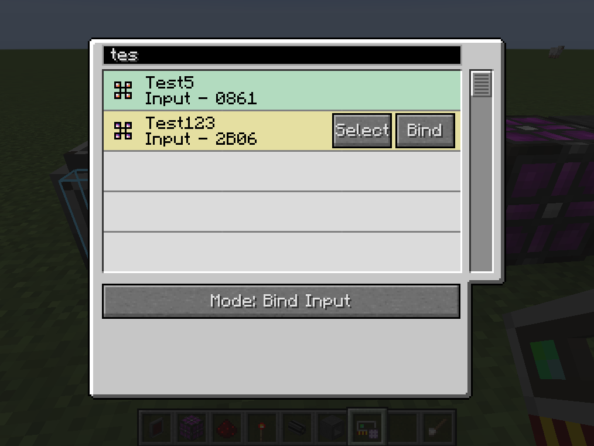

# BetterP2P++

 

Improved fork of Better P2P for Applied Energistics 2, requires [Forgelin](https://www.curseforge.com/minecraft/mc-mods/shadowfacts-forgelin).

## Features

A fork of BetterP2P that has support for custom names (via nameplate inscriber or anvil) as well as a search feature.

## Credits

https://github.com/LasmGratel/BetterP2P

Lasm Gratel and any other developers of BetterP2P

Documentation: <https://lasmgratel.github.io/BetterP2P-Manual/>
